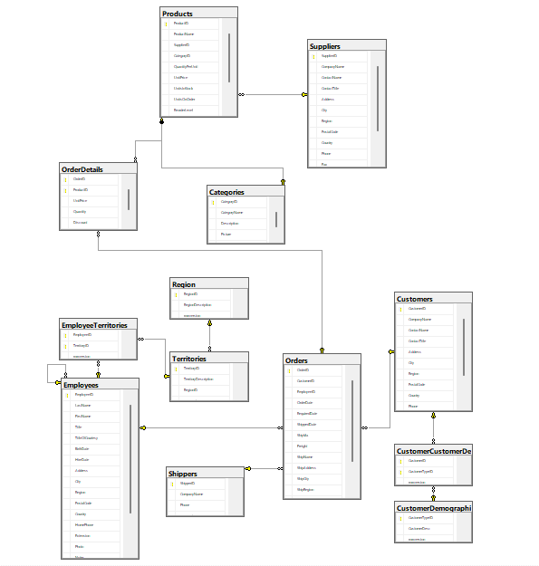
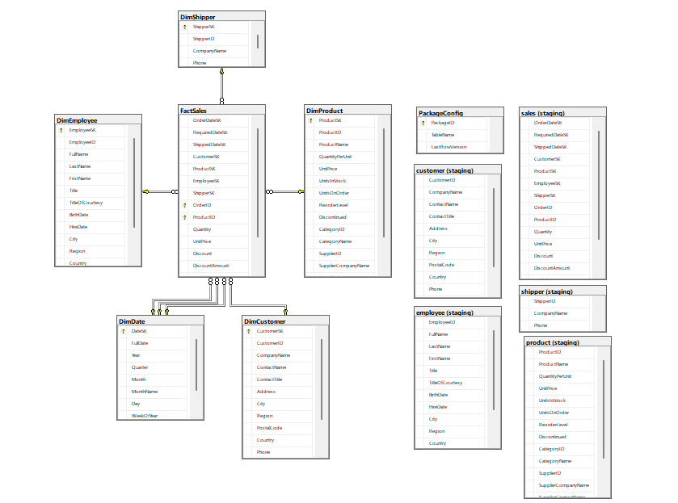

# NorthWind Ecommerce - Base de Datos OLTP y OLAP

## Descripción del Proyecto

Este proyecto implementa la base de datos para un sistema de **Ecommerce** basado en el modelo NorthWind. La solución consta de dos bases de datos principales:

- **NorthWindOLTP**: Base de datos transaccional (OLTP) diseñada para gestionar las operaciones diarias del ecommerce: clientes, pedidos, productos, empleados, proveedores, etc.
- **NorthWindOLAP**: Base de datos analítica (OLAP) con modelo estrella (star schema) para reportes y business intelligence, que incluye datos de ventas, dimensiones de clientes, productos, empleados, fechas y transportistas.

El objetivo es separar el procesamiento de transacciones en línea del análisis de datos, mejorando el rendimiento y la capacidad de reporteo.

## Integrantes del grupo
- Diego Alvarado García
- Erick Alejandro Quiroz Gil
- Sebastian Gustavo Marin Ovando
- Ayelen Anahi Ortiz Robledo
- Jhonny Gary Mamani Cortez
## Modelo de Datos

### Base de Datos OLTP (NorthWindOLTP)

El modelo OLTP está normalizado (3FN) e incluye las siguientes entidades principales:

- **Customers**: Datos de clientes.
- **Suppliers**: Proveedores de productos.
- **Categories**: Categorías de productos.
- **Products**: Productos con relación a categorías y proveedores.
- **Employees**: Empleados con jerarquía (ReportsTo).
- **Shippers**: Empresas de envío.
- **Orders**: Pedidos realizados.
- **OrderDetails**: Detalle de cada pedido (productos, cantidades, precios).
- **CustomerDemographics / CustomerCustomerDemo**: Demografía de clientes.
- **Region / Territories / EmployeeTerritories**: Zonas geográficas y asignación a empleados.

#### Diagrama del modelo OLTP

### Base de Datos OLAP (NorthWindOLAP)

Modelo estrella con:

- **Tabla de hechos**: `FactSales`.
- **Dimensiones**: 
  - `DimDate` (fechas)
  - `DimCustomer`
  - `DimProduct`
  - `DimEmployee`
  - `DimShipper`
- **Esquema staging**: Tablas intermedias para ETL (extracción, transformación y carga).

#### Métricas de Ventas e Ingresos

- Ventas Netas por período (día, mes, trimestre, año)
- Ingreso Bruto por producto/categoría
- Volumen de ventas por producto

#### Diagrama del modelo OLAP

## Instrucciones para Desplegar

Estas instrucciones son para desplegar el proyecto en **SQL Server** utilizando **Visual Studio** con un proyecto de base de datos (SQL Server Database Project).

### Requisitos previos

- SQL Server (2024 o superior recomendado)
- SQL Server Management Studio (SSMS)
- Visual Studio 2024 (incluye SQL Server Data Tools)

### Pasos para desplegar

1. **Abrir el proyecto de base de datos en Visual Studio**
   - Descargar este repositorio
   - Abrir Visual Studio → Abrir un proyecto o una solucion → Buscar la carpeta del repositorio → Seleccionar "NorthWindBI.slnx"

2. **Configurar la publicación para NorthWindOLAP**
   - Hacer clic derecho en el proyecto NorthWindOLAP → "Publish"
   - Configurar la cadena de conexión al servidor SQL Server de destino
   - Establecer el nombre de la base de datos (se creará automáticamente)

3. **Publicar**
   - Hacer clic en "Publish" para ejecutar el despliegue
   - Verificar que no haya errores en la salida

4. **Configurar la publicación para NorthWindOLTP**
   - Hacer clic derecho en el proyecto NorthWindOLTP → "Publish"
   - Configurar la cadena de conexión al servidor SQL Server de destino
   - Establecer el nombre de la base de datos (se creará automáticamente)

5. **Publicar**
   - Hacer clic en "Publish" para ejecutar el despliegue
   - Verificar que no haya errores en la salida

## Notas adicionales

- La columna `rowversion` (timestamp) se incluye en todas las tablas para control de concurrencia.
- Las tablas OLAP incluyen un esquema `staging` para facilitar procesos ETL.
- La tabla `PackageConfig` en OLAP ayuda a gestionar cargas incrementales.
- Los campos `DiscountAmount`, `NetSales` y `GrossRevenue` en `FactSales` están precalculados para mejorar el rendimiento de consultas analíticas.

## Modelo de Negocio: Ecommerce

Este diseño soporta las operaciones típicas de un ecommerce:

- **Gestión de clientes** (CustomerID, datos de contacto, ubicación).
- **Catálogo de productos** (con categorías y proveedores).
- **Procesamiento de pedidos** (Orders + OrderDetails) con control de inventario (UnitsInStock, UnitsOnOrder, ReorderLevel).
- **Envíos** (Shippers, fechas de pedido, requerida y enviada).
- **Empleados y territorios** (para fuerza de ventas).
- **Análisis de ventas** (dimensiones y hechos en OLAP) para informes de ingresos, productos más vendidos, rendimiento por cliente/empleado/región.

---

## Reglas de Negocio - NorthWind Ecommerce

### 1. Reglas de Clientes (Customers)

| ID | Regla de Negocio | Tipo | Implementación |
|----|-----------------|------|-----------------|
| **RN-CUST-01** | Todo cliente debe tener un identificador único de 5 caracteres (alfanumérico) | Estructural | `CustomerID NCHAR(5) NOT NULL PRIMARY KEY` |
| **RN-CUST-02** | El nombre de la empresa del cliente es obligatorio | Obligatoria | `CompanyName NVARCHAR(40) NOT NULL` |

---

### 2. Reglas de Productos (Products)

| ID | Regla de Negocio | Tipo | Implementación |
|----|-----------------|------|-----------------|
| **RN-PROD-01** | El nombre del producto es obligatorio | Obligatoria | `ProductName NVARCHAR(40) NOT NULL` |
| **RN-PROD-02** | El precio unitario no puede ser negativo | Integridad | `CHECK ([UnitPrice] >= 0)` |
| **RN-PROD-03** | Un producto puede ser discontinuado (no se puede vender después de discontinuado) | Estado | `Discontinued BIT NOT NULL` |

---

### 3. Reglas de Pedidos (Orders)

| ID | Regla de Negocio | Tipo | Implementación |
|----|-----------------|------|-----------------|
| **RN-ORD-01** | Un pedido debe estar asociado a un cliente (opcionalmente puede no tenerlo para pedidos anónimos) | Relacional | `FK_Orders_Customers` |
| **RN-ORD-02** | La fecha requerida es la fecha prometida al cliente | Semántica | `RequiredDate DATETIME NULL` |

---

### 4. Reglas de Detalle de Pedido (OrderDetails)

| ID | Regla de Negocio | Tipo | Implementación |
|----|-----------------|------|-----------------|
| **RN-DET-01** | El detalle de pedido tiene una clave compuesta por OrderID + ProductID (una línea por producto por pedido) | Estructural | `PRIMARY KEY (OrderID, ProductID)` |
| **RN-DET-02** | La cantidad de productos debe ser mayor a cero | Integridad | `CHECK ([Quantity] > 0)` |
| **RN-DET-03** | El precio unitario se guarda en el momento del pedido (no se actualiza si cambia el precio del producto después) | Histórica | `UnitPrice MONEY NOT NULL` |
| **RN-DET-04** | El precio unitario no puede ser negativo | Integridad | `CHECK ([UnitPrice] >= 0)` |

---

### 5. Reglas de Empleados (Employees)

| ID | Regla de Negocio | Tipo | Implementación |
|----|-----------------|------|-----------------|
| **RN-EMP-01** | El nombre y apellido del empleado son obligatorios | Obligatoria | `LastName NVARCHAR(20) NOT NULL`, `FirstName NVARCHAR(10) NOT NULL` |
| **RN-EMP-02** | Un empleado puede reportar a otro empleado (relación jerárquica) | Autoreferencial | `FK_Employees_Employees (ReportsTo)` |

---

### 6. Reglas de Control de Concurrencia

| ID | Regla de Negocio | Tipo | Implementación |
|----|-----------------|------|-----------------|
| **RN-CC-01** | Toda tabla debe tener un campo rowversion (timestamp) para control de concurrencia optimista | Técnica | Columna `rowversion timestamp NULL` en todas las tablas |

---

### 7. Reglas OLAP / Analíticas (Business Intelligence)

| ID | Regla de Negocio | Tipo | Implementación |
|----|-----------------|------|-----------------|
| **RN-BI-01** | La tabla de hechos FactSales debe tener claves sustitutas (SK) para todas las dimensiones | Estructural | `CustomerSK`, `ProductSK`, `EmployeeSK`, `ShipperSK`, `OrderDateSK`, `RequiredDateSK`, `ShippedDateSK` |
| **RN-BI-02** | Las métricas de ventas deben precalcularse para mejorar rendimiento | Rendimiento | `DiscountAmount`, `NetSales`, `GrossRevenue` precalculados |
| **RN-BI-03** | La fecha debe tener una dimensión con atributos como año, trimestre, mes, día, fin de semana | Analítica | Tabla `DimDate` |
| **RN-BI-04** | Las claves de negocio originales (OrderID, ProductID) deben conservarse para trazabilidad | Trazabilidad | Columnas `OrderID`, `ProductID` en `FactSales` |
| **RN-BI-05** | Los datos se cargan en staging antes de pasar a dimensiones y hechos | ETL | Esquema `staging` |
| **RN-BI-06** | La tabla PackageConfig permite cargas incrementales basadas en LastRowVersion | ETL | `PackageConfig` con `LastRowVersion` |
